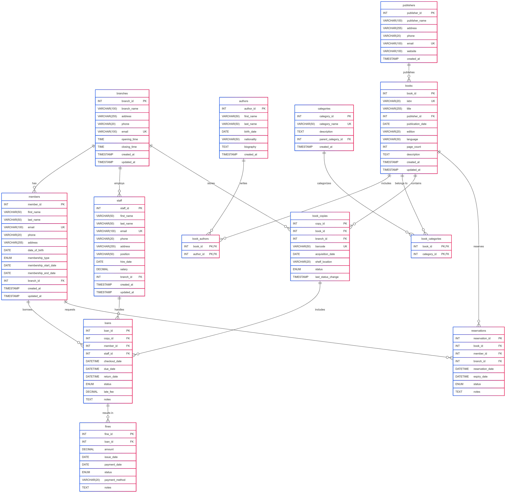

# Library Management System Database

## 📌 Table of Contents
- [Project Overview](#-project-overview)
- [Features](#-features)
- [Database Schema](#-database-schema)
- [Setup Instructions](#-setup-instructions)
- [Sample Queries](#-sample-queries)
- [Technical Specifications](#-technical-specifications)
- [License](#-license)

## 🌟 Project Overview
A complete **MySQL-based Library Management System** designed to automate all library operations. This database handles:

- Book cataloging and inventory tracking
- Patron/member management
- Loan transactions and reservations
- Fine calculation and reporting
- Multi-branch operations

## ✨ Key Features
| Feature           | Description                                  |
|-------------------|----------------------------------------------|
| **Book Management**| Track titles, authors, publishers, categories |
| **Member System**  | Manage patrons with different membership tiers |
| **Loan Tracking**  | Automatic due dates, return status, fines    |
| **Reporting**      | Generate overdue lists, popular titles, etc. |
| **Multi-Branch**   | Support for multiple library locations        |

## 🗃 Database Schema

### Entity Relationship Diagram


Core Tables:
- `books` - Master book records
- `authors` - Writer information
- `members` - Library patrons
- `loans` - Checkout transactions
- `branches` - Physical locations

## 🚀 Setup Instructions

### Prerequisites
- MySQL Server 8.0 or higher
- At least 100MB free storage
- Command line access to MySQL

### Installation Methods

#### Method 1: Command Line Import
```bash
mysql -u [username] -p < library_management_system.sql
```

#### Method 2: Using MySQL Workbench
1. Open MySQL Workbench.
2. Connect to your MySQL server.
3. Open the `library_management_system.sql` file.
4. Execute the script to create the database and tables.

## 🔍 Sample Queries

Here are some example queries to get started:

- List all books with their authors:
```sql
SELECT b.title, a.name AS author
FROM books b
JOIN authors a ON b.author_id = a.id;
```

- Check current loans for a member:
```sql
SELECT l.loan_id, b.title, l.due_date
FROM loans l
JOIN books b ON l.book_id = b.id
WHERE l.member_id = [member_id] AND l.return_date IS NULL;
```

- Calculate fines for overdue books:
```sql
SELECT member_id, SUM(fine_amount) AS total_fines
FROM fines
WHERE paid = 0
GROUP BY member_id;
```

## 🛠 Technical Specifications

- Database: MySQL 8.0+
- SQL Scripts: ANSI SQL compliant
- Designed for multi-branch library systems
- Supports fine calculation and reporting
- Scalable for large book inventories and member bases

## 📄 License

This project is licensed under the MIT License. See the [LICENSE](LICENSE) file for details.

---

© 2025 Brian Kioko. All rights reserved.
